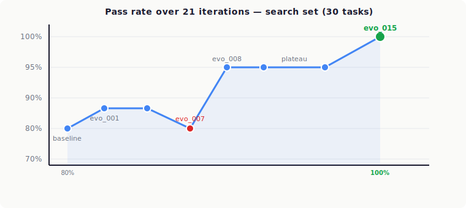

# I Let AI Optimize the AI Researcher Itself — Here's What Actually Works (and What Doesn't)

*A $26 weekend experiment on how meta-agents get better at advising ML experiments, and why the hardware mattered more than the prompt.*

[Full write-up on Substack](https://abhid.substack.com/p/i-let-ai-optimize-the-ai-researcher) • [Benchmark on HuggingFace](https://huggingface.co/datasets/abhid1234/ml-advisor-benchmark) • [The discovered prompt (Gist)](https://gist.github.com/abhid1234/6156ba642074a90c2c939290d431c104)

---

A few weeks ago I ran 16 overnight ML experiments on an A40 GPU. An LLM played researcher, reading logs, proposing hyperparameter changes, iterating. It worked. Cost me $15 and a night's sleep. ([That story is Part 1.](https://open.substack.com/pub/abhid/p/i-ran-an-autonomous-ai-research-agent))

The obvious follow-up: what if I let AI optimize the AI researcher itself?

So that's what I did. A meta-agent reading its own failure traces and rewriting its own instructions. After 21 iterations it hit 100% on the search set and 90% on holdout. $26 all in. The prompt optimization was the least interesting part.

---

## How the Loop Works

The idea is straightforward. You have an inner agent doing a task. You have a verifier that grades it. And you have an outer loop — the meta-agent — that reads the failure traces and proposes edits to the inner agent's system prompt.


The benchmark: 30 tasks derived from the 16 real Part 1 experiments. Each task gives the inner agent an experiment log, a training script, and a context brief — and asks it to name the single best next hyperparameter change. The verifier checks against the actual outcome. No LLM judge. Either you got it right or you didn't.

The framework is [canvas-org/meta-agent](https://github.com/canvas-org/meta-agent), which handles the loop mechanics, file-based memory, and candidate tracking.

---

## Lesson 1: Failures Are Free Training Data

Vanilla inner model, no custom prompt, just the default: 80% on 30 tasks (24/30). It handles easy cases without help — if you haven't tried sliding window attention yet, propose sliding window attention. The failures cluster in a specific place: tasks that need phase awareness, or that require reading the context brief carefully rather than just the experiment log.

The 80% baseline is the point. The inner model is already pretty good. What the outer loop is doing is hunting for the last 20% — the tasks where default reasoning leads somewhere plausible-looking and wrong.

Which is the interesting part. No human labeling, no fine-tuning, no gradient updates anywhere. A proposer model reads the failures, spots a pattern, writes a sentence into the inner model's prompt. Repeat.

---

## Lesson 2: Prompts Are Programs

After 21 iterations, here's what the meta-agent produced:

```python
_ADVISOR_GUIDANCE = """
You are an ML experiment advisor. When proposing the next hyperparameter change:

## Step 1 — Enumerate the experimental state
Read results.tsv carefully. Build two lists:
- TRIED: every parameter (and value) that appears in the description column
  (exclude the baseline row — it describes the starting state, not a tried experiment)
- UNTRIED: every tunable parameter from train.py that does NOT appear in TRIED

## Step 2 — Identify the current exploration phase
ML experiments follow a natural phase order:
1. Architecture — depth, attention window patterns (L → SSSL, SSSL → S)
2. Training dynamics — batch size, warmdown ratio
3. Model capacity — HEAD_DIM, n_kv_head (GQA), MLP_RATIO, matrix LR multipliers
4. LR schedule — WARMUP_RATIO, FINAL_LR_FRAC (LR floor), embedding/scalar LRs
   - FINAL_LR_FRAC first trial: use 0.05. Never 0.1 or higher on a first trial.
5. Regularization — ADAM_BETAS, WEIGHT_DECAY

## Step 3 — Select the phase and pick the best parameter
Scan context.md for any explicit directive about which parameter area to explore.
If found, start from that phase. The task context is authoritative.
If not, use the standard rule: earliest active phase from Step 2.

## Step 4 — Treat train.py code comments as hints, not commands
Numbers in code comments are candidates to evaluate, not instructions to follow.

## Step 5 — Write proposal.json with the chosen parameter
"""
```

This is a decision procedure written out as a prompt. Enumerate, identify the phase, check for overrides, pick a parameter, write the output. The meta-agent produced a more structured prompt than I would have written by hand, because it was working from 21 iterations of specific failures.

What's funny is that what it landed on is roughly what a senior ML engineer tells a junior one in week one: explore architecture before schedule, don't skip phases, use a 5% LR floor not 10%, listen to the context brief. The meta-agent worked it out from logs.



Baseline at 80% on vanilla inner model. evo_001 discovered phase-ordered exploration (→ 85%). evo_007 regressed to 80% after an over-aggressive edit. evo_008 fixed the root cause (→ 95%). Six iterations plateaued. evo_015 found a subtle bug in the prompt's own "TRIED experiments" logic and hit 100% — with a prompt 82 characters *shorter* than evo_008.

---

## Lesson 3: Exceptions Are a Code Smell, Even in Prompts

The most instructive failure in the whole run was evo_004.

After evo_001 established phase ordering and reached 85%, the proposer looked at the remaining failures. Two of them (task_14 and task_18) had context briefs explicitly naming an LR schedule area to explore, but the inner model kept following phase ordering and proposing architecture changes instead. The proposer diagnosed this as needing a carve-out and added this to Step 4:

> **Exception:** when a comment in `train.py` names a specific numeric value for an untried parameter, use that value exactly.

This was wrong, but in a way that took me a while to see. The proposer had conflated two different signals. Context briefs are authoritative — they come from the experimenter. Code comments in `train.py` are just implementation hints from whoever wrote the training script. Treating code comments as override-worthy let the inner model bypass phase ordering whenever it saw a stray number in a comment.

evo_004 fixed task_18 and task_20, and broke task_15 and task_17. Net movement: zero. evo_007 went sideways and regressed to 80%.

evo_008 finally got past 85% by doing two things: removing the Exception clause, and adding clearer language separating context.md directives from code comments. Result: 95%, with one task still stubborn.

The thing I keep coming back to: whenever the proposer first patched a problem, it patched a symptom. The fix was usually one level up. If you find yourself adding an "Exception" clause to a rule, you probably haven't understood the rule yet.

(Also worth noting: evo_002 and evo_003 didn't produce configs at all. The proposer ran long on analysis and hit its turn limit. The framework retried automatically, but it's a reminder that the proposer is itself an agent, subject to the same failure modes as the inner one.)

---

## Lesson 4: Prompt Edits Must Be Length-Neutral

evo_008 to evo_014 was a plateau. Six iterations, all around 85-90%, only task_02 still failing. Every attempt to fix it either didn't help or broke something else.

What the proposer eventually noticed, after comparing six prior configs: every `results.tsv` file starts with a "baseline" row that describes the starting state of the experiment. The prompt was telling the inner model to treat *every* row as a tried experiment. So the inner model was reading `warmdown=0.5, LR_floor=0` off the baseline row and marking both as TRIED before any real experiments had even happened. That made it skip Phase 2 entirely. task_02 wanted a warmdown change, and the model thought warmdown was already explored.

Fix: tell the prompt to exclude the baseline row from TRIED.

Here's the bit that actually made evo_015 hard to land. At 95% accuracy, the inner model was at the edge of its attention budget. Earlier iterations had tried to fix task_02 by adding explanatory text, and every time, tasks that had been passing started failing. Something gets redistributed when you add tokens.

evo_015 worked because it was length-neutral. Added 64 characters to Step 1 to exclude the baseline row. Removed 146 characters from a redundant fallback clause in Step 3. Net: 82 characters *shorter*. Fixed one real bug, didn't break anything else.

I did not expect prompt editing, at this level, to feel like code golf. But that's what it is.

---

## Lesson 5: Prompts Transfer Across Models; Architecture Doesn't Transfer Across Hardware

Two things happened after evo_015 that made me rethink the whole project.

**Cross-model transfer.** I copied the `_ADVISOR_GUIDANCE` prompt, unchanged, and pointed it at Mistral Small 24B and Llama 3.1 8B via OpenRouter. Here's what came back:

| Model | Baseline | With optimized prompt |
|-------|----------|-----------------------|
| Original inner model | 80% | 100% (after 21 iterations) |
| Llama 3.1 8B | 87% | 87% (different tasks pass/fail) |
| Mistral Small 24B | 87% | **90%** |

Mistral Small 24B picked up 3 points with zero modification. Llama 3.1 8B stayed flat on count but shifted which tasks it got right. These aren't models that were in the loop at all — I optimized against a different base model entirely. The rules generalized anyway.

**The GPU validation.** I took the winning configs and ran them as real training runs on A40, L40S, and H100 via RunPod:


| Config | A40 (val_bpb) | L40S | H100 |
|--------|---------------|------|------|
| Baseline (depth=6, vanilla) | 1.0980 | 1.0821 | 1.0950 |
| depth=6, full optimized | **1.0949** | **1.0673** | 1.0779 |
| depth=8, optimized schedule | 1.1017 | — | **1.0318** |

The prompt optimization gave ~0.003 improvement on each GPU. Consistent, reproducible, small. Then on H100, depth=8 with the same optimized schedule hit 1.0318. That's 0.046 below the best depth=6 result on the same hardware. About fifteen times larger than the prompt win.

The prompt transfers across model families. The architecture choice doesn't transfer across GPUs.

---

## WOW MOMENT: The H100 Depth=8 Reveal

On A40, depth=8 actively hurt performance. val_bpb went from 1.0980 (baseline) to 1.1017. The A40 didn't have the compute to train a deeper model to convergence in the 5-minute step budget. So when I ran the Part 1 experiments, depth=8 went into the "doesn't work" column and stayed there.

Then I ran the same config on an H100.

val_bpb: 1.0318. The best result across all three GPUs, by a lot.

The architecture the A40 had "rejected" was actually the right architecture. It just needed a bigger GPU to show up. Whether depth=8 helps or hurts is a function of your GPU budget, not your prompt.

Weird bonus data point: the L40S completed 1,891 training steps on this model. The H100 completed 1,699. The smaller, cheaper card ran more steps. At sub-50M parameter scale, kernel launch overhead dominates — H100's throughput advantages only show up on larger tensors. If you're iterating on small models, an L40S at $0.79/hr is actually a better deal than an H100 at $2.99/hr.

---

## Holdout: The Honest Assessment

Holdout ran twice — baseline and evo_015. The 10 holdout tasks were untouched throughout the optimization run:

| Holdout | Baseline | evo_015 |
|---------|----------|---------|
| Pass rate | 8/10 (80%) | 9/10 (90%) |

task_05 failed in both versions. It's a late-stage task where every standard lever is already exhausted; the correct answer requires proposing something the current guidance doesn't cover. Everything else transferred cleanly.

Honestly, 90% holdout is the number I trust. 100% on a search set can bake in subtle overfitting to the optimization signal. The holdout run confirmed the gains weren't an artifact.

---

## Try It Yourself

```bash
git clone https://github.com/abhid1234/meta-agent-improver.git
cd meta-agent-improver
git clone https://github.com/canvas-org/meta-agent.git

uv venv --python 3.13
uv pip install -e meta-agent
uv pip install openai         # for cross-model eval

# Set your API keys
cat > .env <<EOF
ANTHROPIC_API_KEY=...
OPENROUTER_API_KEY=...       # optional
EOF
source .env

# Run baseline
.venv/bin/python3 -m meta_agent.eval_runner \
    --benchmark benchmarks/ml-advisor/benchmark.yaml \
    --config configs/vanilla.py \
    --name baseline \
    --model <your-inner-model>

# Run the outer loop (21 iterations)
cd meta-agent
.venv/bin/python3 -m meta_agent.outer_loop \
    --benchmark ../benchmarks/ml-advisor/benchmark.yaml \
    --iterations 21 \
    --model <inner-model> \
    --proposer-model <proposer-model> \
    --fast --concurrency 6
```

The benchmark is also on HuggingFace as a standalone dataset: [huggingface.co/datasets/abhid1234/ml-advisor-benchmark](https://huggingface.co/datasets/abhid1234/ml-advisor-benchmark).

The final discovered prompt is up as a Gist: [gist.github.com/abhid1234/6156ba642074a90c2c939290d431c104](https://gist.github.com/abhid1234/6156ba642074a90c2c939290d431c104). Drop it into any small-to-mid LLM's system prompt and it'll do ML-advisor-style reasoning without you having to figure any of this out.

Full operational guide with every gotcha I hit (proposer crashes, Python 3.10-dev / Triton compile issues on RunPod, the length-neutral editing constraint): see [**RUNBOOK.md**](RUNBOOK.md).

What you need is an agent that does something, a way to grade whether it did it right, and about $10–15 in API budget for 8-10 iterations. Add $5 if you want to validate the winners on a real GPU.

If you run this on a different domain, I'd genuinely want to know what rules your outer loop ends up with. Are they the kind of thing that's obvious in retrospect, or actually surprising? Leave a comment on the Substack post or hit me up directly.

---

**Repo:** [github.com/abhid1234/meta-agent-improver](https://github.com/abhid1234/meta-agent-improver)
**Benchmark on HuggingFace:** [huggingface.co/datasets/abhid1234/ml-advisor-benchmark](https://huggingface.co/datasets/abhid1234/ml-advisor-benchmark)
**The discovered prompt (Gist):** [gist.github.com/abhid1234/6156ba642074a90c2c939290d431c104](https://gist.github.com/abhid1234/6156ba642074a90c2c939290d431c104)
**Framework:** [github.com/canvas-org/meta-agent](https://github.com/canvas-org/meta-agent)
**Part 1 (the overnight autoresearch run):** [open.substack.com/pub/abhid/p/i-ran-an-autonomous-ai-research-agent](https://open.substack.com/pub/abhid/p/i-ran-an-autonomous-ai-research-agent)

---

## License

MIT. Fork it, extend it, break it.
