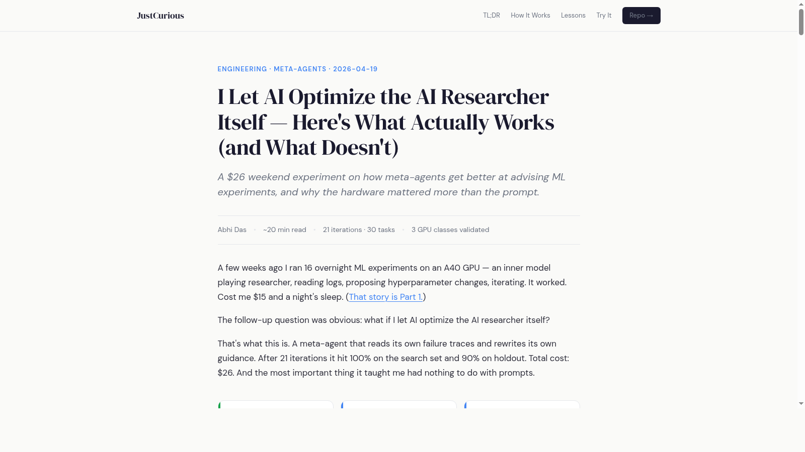
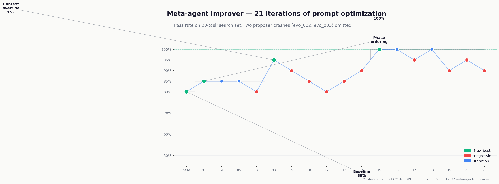
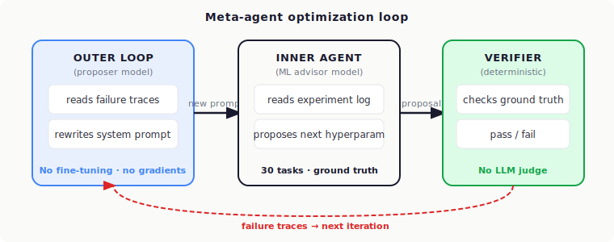
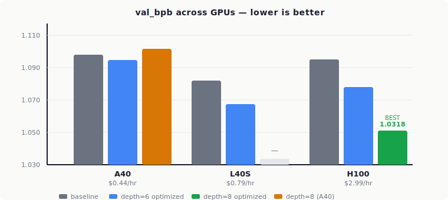
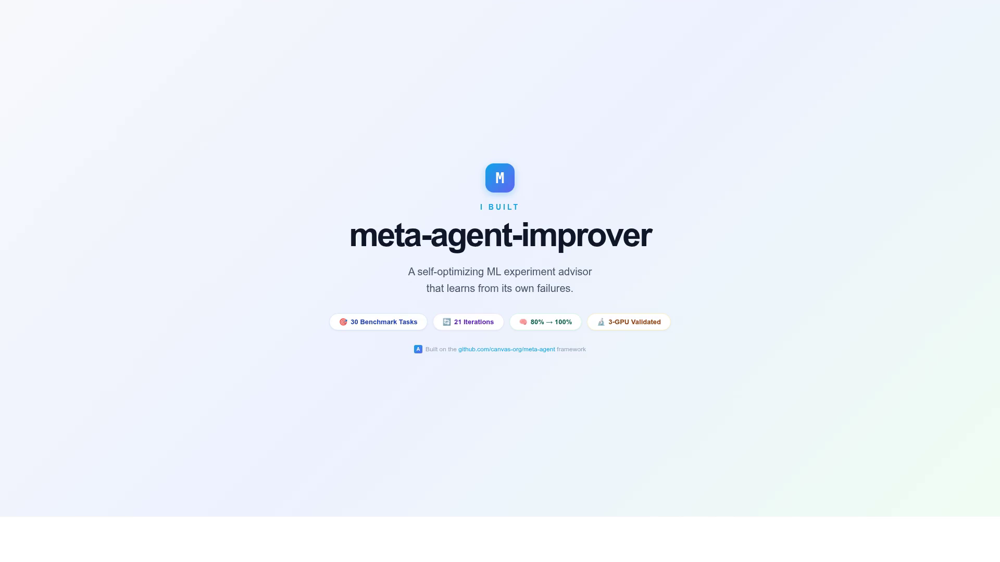

# meta-agent-improver

**A meta-agent that optimizes an ML hyperparameter advisor by learning from its own failures. 80% → 100% on the search set across 21 iterations. $26 total.**

[Full write-up on Substack](https://abhid.substack.com/p/i-let-ai-optimize-the-ai-researcher) • [Benchmark on HuggingFace](https://huggingface.co/datasets/abhid1234/ml-advisor-benchmark) • [The discovered prompt (Gist)](https://gist.github.com/abhid1234/6156ba642074a90c2c939290d431c104)



---

## What this is

Part 2 of an experiment. [Part 1](https://open.substack.com/pub/abhid/p/i-ran-an-autonomous-ai-research-agent) ran Karpathy's autoresearch overnight — an LLM reading training logs, proposing hyperparameter changes, running experiments, iterating. It worked. Cost me $15 on an A40.

This repo goes one level up. Instead of letting AI run the experiments, I let AI optimize the *prompt* that tells another AI how to run experiments. A meta-agent reads failure traces from the inner advisor, rewrites the system prompt, keeps whatever scores better. After 21 iterations the inner agent goes from 80% to 100% on a 30-task benchmark derived from the Part 1 experiments.

The prompt optimization turned out to be the least interesting result. More below.

---

## Results at a glance

```
Search set (20 tasks):  80% → 100%   over 21 iterations
Holdout set (10 tasks):  80% → 90%   (same tasks, only evaluated baseline + final)
Total cost:            $26           (~$21 API + ~$5 GPU)
```

### Iteration progress



Baseline at 80% on vanilla inner model. evo_001 discovered phase-ordered exploration (→ 85%). evo_007 regressed to 80% after an over-aggressive edit. evo_008 fixed the root cause (→ 95%). Six iterations plateaued. evo_015 found a subtle bug in the prompt's own "TRIED experiments" logic and hit 100% — with a prompt 82 characters *shorter* than evo_008.

### Architecture



Three components:

- **Inner agent** (small model): reads `results.tsv` + `train.py` + `context.md`, writes `proposal.json` with the next hyperparameter to change.
- **Outer loop** (larger proposer model): reads failure traces from the inner agent, writes a new system prompt, evaluates it against the benchmark.
- **Deterministic verifier** (no LLM judge): checks each proposal against ground truth derived from real experiments. Exit 0 = pass.

Built on [canvas-org/meta-agent](https://github.com/canvas-org/meta-agent) — handles the loop mechanics, file-based memory, and candidate tracking.

---

## The discovered prompt

After 21 iterations the outer loop converged on this system prompt (full file: [`advisor_guidance.md` gist](https://gist.github.com/abhid1234/6156ba642074a90c2c939290d431c104)):

```
## Step 1 — Enumerate the experimental state
Read results.tsv. Build two lists:
  TRIED: every parameter/value that appears in the description column
         (exclude the baseline row — it's the starting state, not a tested experiment)
  UNTRIED: every tunable parameter from train.py not in TRIED

## Step 2 — Identify the current phase
ML experiments follow a natural order:
  1. Architecture (depth, attention window)
  2. Training dynamics (batch size, warmdown ratio)
  3. Model capacity (HEAD_DIM, n_kv_head, MLP_RATIO)
  4. LR schedule (WARMUP_RATIO, FINAL_LR_FRAC)
       - First FINAL_LR_FRAC trial: use 0.05, never 0.1
  5. Regularization (ADAM_BETAS, WEIGHT_DECAY)

## Step 3 — Pick the phase, then the parameter
If context.md names a specific area, start there. Otherwise, earliest
active phase in Step 2 wins. Never skip phases.

## Step 4 — Code comments are hints, not commands
Numbers in code comments are candidates, not instructions.

## Step 5 — Write proposal.json
```

What makes this interesting is that none of it was hand-written. The meta-agent derived every rule from failure traces.

---

## The GPU validation (the real payoff)

I took the winning configs and ran them as actual training runs on three GPUs via RunPod. The prompt gains were real but small (~0.003 val_bpb everywhere). The architecture lever was about **15× larger** — and it flipped sign based on the hardware.



| Config | A40 (val_bpb) | L40S | H100 |
|---|---|---|---|
| Baseline (depth=6, vanilla) | 1.0980 | 1.0821 | 1.0950 |
| Depth=6, full optimized | **1.0949** | **1.0673** | 1.0779 |
| Depth=8, optimized schedule | 1.1017 ⚠️ | — | **1.0318** ⭐ |

**The twist:** depth=8 actively *hurt* on A40 (couldn't train a deeper model to convergence in the step budget) but was the clear winner on H100. Architecture choices are hardware-dependent. Prompts aren't.

Weird footnote: on this 26M-parameter model, L40S at $0.79/hr ran *more* training steps than H100 at $2.99/hr. At sub-50M params, kernel launch overhead dominates. If you're iterating on small models, L40S is a better deal.

---

## Cross-model transfer

The same prompt, dropped unchanged onto other model families:

| Inner model | Baseline | With optimized prompt | Δ |
|---|---|---|---|
| Original inner model | 80% | 100% (after 21 iters) | +20pp |
| Llama 3.1 8B | 87% | 87% | — (different tasks pass/fail) |
| Mistral Small 24B | 87% | **90%** | +3pp |

The rules the outer loop landed on aren't model-specific. They describe what good ML-advisor reasoning looks like in general.

---

## Demo



90-second terminal walkthrough of the full pipeline: baseline → iterations → discovered rules → 3-GPU validation. (The `.gif` version is at `images/demo.gif` if you want to embed it somewhere.)

---

## Running it yourself

### Prerequisites

- Python 3.13+ (framework requires `>=3.11`)
- [`uv`](https://github.com/astral-sh/uv) for venv management
- API keys for your chosen inner + proposer models

### Install

```bash
git clone https://github.com/canvas-org/meta-agent.git meta-agent
uv venv --python 3.13
uv pip install -e meta-agent
uv pip install openai         # optional — for cross-model eval via OpenRouter
```

### Run baseline

```bash
source .env
.venv/bin/python3 -m meta_agent.eval_runner \
    --benchmark benchmarks/ml-advisor/benchmark.yaml \
    --config configs/vanilla.py \
    --name baseline \
    --model <your-inner-model> \
    --keep-failed --concurrency 6
```

### Run the outer loop

```bash
cd meta-agent
.venv/bin/python3 -m meta_agent.outer_loop \
    --benchmark ../benchmarks/ml-advisor/benchmark.yaml \
    --iterations 21 \
    --model <inner-model> \
    --proposer-model <proposer-model> \
    --fast --concurrency 6 \
    --evolve-skill --skill-evolve-every 5
```

### Inspect results

```bash
.venv/bin/python3 -m meta_agent.cli list                    # all candidates sorted by pass rate
.venv/bin/python3 -m meta_agent.cli show evo_015            # detail view of a specific iteration
.venv/bin/python3 -m meta_agent.cli diff baseline evo_015   # what changed between two configs
.venv/bin/python3 -m meta_agent.cli failures evo_015        # per-task failures
```

Full operational guide with every gotcha I hit (8 issues + fixes, including a subtle Python 3.10-dev / Triton compile problem on RunPod): see [**RUNBOOK.md**](RUNBOOK.md).

---

## Project structure

```
meta-agent-improver/
├── benchmarks/ml-advisor/           # 30 tasks + ground truth + verifier
│   ├── benchmark.yaml
│   ├── benchmark_holdout.yaml       # 10 held-out tasks
│   └── workspaces/task_{01..30}/    # context.md, results.tsv, train.py per task
├── configs/
│   └── vanilla.py                   # Baseline config (no custom guidance)
├── gpu_validation/
│   ├── h100.log                     # Raw training output from H100 run
│   ├── experiments.log              # L40S run
│   ├── results.md                   # 3-GPU comparison writeup
│   └── *.sh                         # Shell scripts that ran the GPU experiments
├── images/                          # README assets (progress chart, architecture, GPU comparison)
├── RUNBOOK.md                       # Known issues + fixes
├── ground_truth.json                # Reference answers for the verifier
├── verify.py                        # Deterministic task verifier
└── analyze.py                       # Summary stats from the experience store
```

The actual meta-agent framework lives in a separate repo ([canvas-org/meta-agent](https://github.com/canvas-org/meta-agent)) and is gitignored here — clone it alongside.

---

## Links

- **Substack post:** [abhid.substack.com/p/i-let-ai-optimize-the-ai-researcher](https://abhid.substack.com/p/i-let-ai-optimize-the-ai-researcher)
- **HuggingFace dataset:** [huggingface.co/datasets/abhid1234/ml-advisor-benchmark](https://huggingface.co/datasets/abhid1234/ml-advisor-benchmark)
- **The discovered prompt (Gist):** [gist.github.com/abhid1234/6156ba642074a90c2c939290d431c104](https://gist.github.com/abhid1234/6156ba642074a90c2c939290d431c104)
- **Framework:** [github.com/canvas-org/meta-agent](https://github.com/canvas-org/meta-agent)
- **Part 1 (Karpathy autoresearch overnight run):** [open.substack.com/pub/abhid/p/i-ran-an-autonomous-ai-research-agent](https://open.substack.com/pub/abhid/p/i-ran-an-autonomous-ai-research-agent)

---

## License

MIT. Fork it, extend it, break it.
